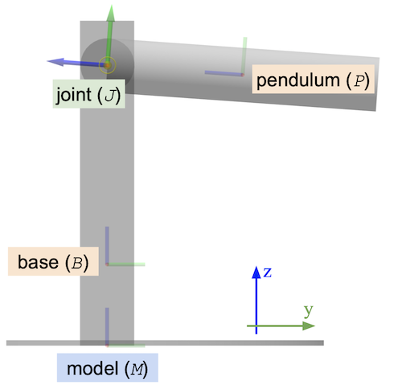
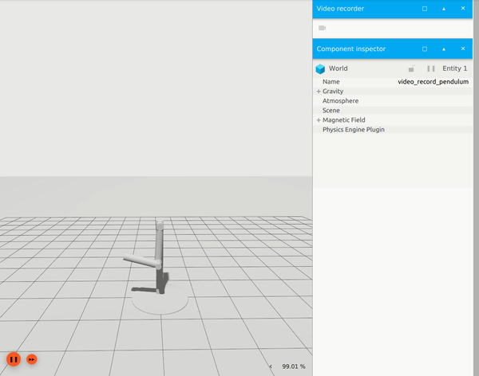

# Pose Frame Semantics Tutorial

This documentation explains the implemented changes proposed by
[Pose Frame Semantics Proposal](http://sdformat.org/tutorials?tut=pose_frame_semantics_proposal) in SDFormat 1.7.

## What's New In SDFormat 1.7 With Examples





### `//pose/@relative_to`

```xml
<sdf version="1.7">
  <model name="pendulum_with_base">
    <link name="base">
      <pose>0 0 0.3   0 0 0</pose>
    </link>
    <link name="pendulum">
      <pose relative_to="joint">
        0 0 -0.5 0 0 0
      </pose>
    </link>
    <joint name="joint" type="revolute">
      <parent>base</parent>
      <child>pendulum</child>
      <pose relative_to="base">
        0 0 0.73 1.57 0 0
      </pose>
      <axis>
        <xyz>1 0 0</xyz>
      </axis>
    </joint>
  </model>
</sdf>
```

### `//frame/@attach_to`

```xml
<sdf version="1.7">
  <model name="pendulum_with_base">
    ...
    <frame name="tip" attached_to="pendulum">
      <pose>0 0 -0.5 -1.57079 0 0</pose>
    </frame>
    <link name="pendulum">
      <visual name="tip_visual">
        <pose relative_to="tip"/>
        ...
      </visual>
    </link>
  </model>
</sdf>
```

### Canonical link

```xml
<sdf version="1.7">
  <model name="pendulum_with_base" canonical_link="base">
    <link name="base">
    ...
    </link>
  </model>
</sdf>
```

### Naming requirements for links, joints and frames

See [Name conflicts and scope](###name-conflicts-and-scope) and
[Unique names and reserved names](##unique-names-and-reserved-names).

### @expressed_in instead of `use_parent_model_frame`

```xml
<sdf version="1.7">
  <model name="pendulum_with_base">
    <link name="base">
      ...
    </link>
    <link name="pendulum">
      ...
    </link>
    <joint name="joint" type="revolute">
      ...
      <axis>
        <xyz expressed_in="pendulum_with_base">1 0 0</xyz>
      </axis>
    </joint>
  </model>
</sdf>
```

## Pose and frame

The pose of a model represents the location and orientation of the model in
a three-dimensional space. See [Specifying Pose in Sdformat](http://sdformat.org/tutorials?tut=specify_pose&cat=specification&) for more detail.
The coordinate frame of which the pose relative to is specified using `//pose/@relative_to`
attribute.

It is also important to know how frames of each entity
relate to each other. SDFormat establishes this relationship using the
`//frame` tag which is explained further below.

### `//pose`

```xml
<model name="model_1">
  <pose relative_to="frame_1">0 0 1 0 0 0</pose>
</model>
```

In the example above, the model named `model_1` has initial position of
`[0, 0, 1]` (x, y, z), and orientiation of `[0, 0, 0]` (roll, pitch, yaw).
This model's pose is expressed in the coordinate frame named `frame_1`. This
particular frame must be an explicit or implicit frame in the current scope.
Explicit and implicit frames are explained in [Implicit and explicit frames](##-Implicit-and-explicit-frames) below.


Empty `//pose` tags can be interpreted as equivalent to the identity pose.
In the following examples, the `//pose` elements in each pair are equivalent to each other.

```xml
<pose/>
<pose>0 0 0 0 0 0</pose>
```

```xml
<pose relative_to='frame_name' />
<pose relative_to='frame_name'>0 0 0 0 0 0</pose>
```

If the `//pose/@relative_to` attribute is not defined, the `//pose` of an entity is
relative to its parent entity's frame by default, such as a link's pose relative to
its parent model's frame, with the exception of joint entity type, whose pose is
relative to the frames of links that the joint connects.

### `//frame`

```xml
<model name="model_2">
  <frame name="frame_2" attached_to="frame_1">
    <pose relative_to="frame_1">0 0 0 0 0 0</pose>
  </frame>
</model>
```

Three properties of frame are defined above: the frame's name, another frame that
it attaches to, and the initial pose of the frame.
The `//frame//@name` is a required attribute and must be non-empty and unique.
The `//frame/@attached_to` is optional and specifies the link or nested model to
which the `//frame` is attached. To differentiate from `//pose/@relative_to`,
`//pose/@relative_to` only defines the initial pose of the frame, whereas
`//frame/@attached_to` determines the new pose resulted from any movement
of `model_2`.

Empty `//frame` tag can be interpreted as having an identity pose relative to
`//frame/@attached_to`. The four frame examples below are equivalent.

```xml
<frame name="F" attached_to="A" />
<frame name="F" attached_to="A">
  <pose />
</frame>
<frame name="F" attached_to="A">
  <pose relative_to="A" />
</frame>
<frame name="F" attached_to="A">
  <pose relative_to="A">0 0 0 0 0 0</pose>
</frame>
```

If `//frame/@attached_to` is specified, it needs to contain the name
of an [explicit or implicit frame](##-Implicit-and-explicit-frames) in the current
scope.  If a `//frame` is specified, recursively following the `@attached_to`
attributes of the specified frames must lead to the name of a link.
<!-- TODO: add rules and examples about cycles in graph -->
If the attribute is not specified, the frame
is attached to the model frame and thus indirectly attached to the canonical link.

Some examples of the above senarios are shown below.

```xml
<model name="frame_attaching">
  <link name="L"/>
  <frame name="F00"/>                  <!-- VALID: Indirectly attached_to canonical link L via the model frame. -->
  <frame name="F0" attached_to=""/>    <!-- VALID: Indirectly attached_to canonical link L via the model frame. -->
  <frame name="F1" attached_to="L"/>   <!-- VALID: Directly attached_to link L. -->
  <frame name="F2" attached_to="F1"/>  <!-- VALID: Indirectly attached_to link L via frame F1. -->
  <frame name="F3" attached_to="A"/>   <!-- INVALID: no sibling frame named A. -->
</model>
```

```xml
<model name="nested_model_attaching">
  <link name="L"/>
  <model name="M">
    <link name="L"/>
  </model>
  <frame name="F00"/>                  <!-- VALID: Indirectly attached_to canonical link L via the model frame. -->
  <frame name="F0" attached_to=""/>    <!-- VALID: Indirectly attached_to canonical link L via the model frame. -->
  <frame name="F1" attached_to="M"/>   <!-- VALID: Indirectly attached_to nested model M. -->
  <frame name="F2" attached_to="F1"/>  <!-- VALID: Indirectly attached_to nested model M via frame F1. -->
</model>
```

```xml
<model name="joint_attaching">
  <link name="P"/>
  <link name="C"/>
  <joint name="J" type="fixed">
    <parent>P</parent>
    <child>C</child>
  </joint>
  <frame name="F1" attached_to="P"/>   <!-- VALID: Directly attached_to link P. -->
  <frame name="F2" attached_to="C"/>   <!-- VALID: Directly attached_to link C. -->
  <frame name="F3" attached_to="J"/>   <!-- VALID: Indirectly attached_to link C via joint J. -->
  <frame name="F4" attached_to="F3"/>  <!-- VALID: Indirectly attached_to link C via frame F3. -->
</model>
```

```xml
<model name="frame_attaching_cycle">
  <link name="L"/>
  <frame name="F0" attached_to="F0"/>  <!-- INVALID: cycle in attached_to graph does not lead to link. -->
  <frame name="F1" attached_to="F2"/>
  <frame name="F2" attached_to="F1"/>  <!-- INVALID: cycle in attached_to graph does not lead to link. -->
</model>
```

## Implicit and explicit frames

Frames defined in `//model` (`//model/frame`) and `//world` (`//world/frame`) are considered
explicit frames, whereas frames implied by non `/frame` tags are considered implicit frames.
Implicit frames are mostly introduced by convenience, instead of using explicit `/frame` tag.

The following is a list of implicit frames.

* World frame: each world has a fixed inertial reference frame named `world` that is
  the default frame to which explicit world frames defined by `//world/frame`
  are attached.
* Model frame: each model has a frame that is attached to one of its links
  Depending on the context, a model frame can be referenced with `__model__`
  or `//model/@name`.
  The model frame is the default frame to which explicit model frames
  defined by `//model/frame` are attached.
* Link frame: each link has a frame named `//link/@name` attached to the
  link at its origin defined by `//link/pose`.
* Joint frame: each joint has a frame named `//joint/@name` attached to the
  child link at the joint's origin defined by `//joint/pose`.
  As a direct consequence, `world` is no longer permitted to be specified
  as a child link of a joint, since that would break encapsulation of the
  model.

### World frame

The implicit world frame can be referenced by calling `world`, but this cannot be used
from within `//model` entities, with the exception of specifying `//joint/parent`.
To avoid ambiguity, sibling frames - explicit frames specified by `//world/frame` and implicit frames specified by `//world/model` must have unique names.

A `//world/frame` can be attached to an implicit frame (defined by `//world` or `//world/model`)
or to an explicit frame defined by `//world/frame`. If the `//world/frame/@attached_to`
attribute is not specified or is left empty, the frame will be attached to the world frame.
If the attribute is specified, it must refer to a sibling `//world/frame` or `//world/model`.

When a `//world/frame` is attached to a `//world/model`, it is indirectly attached to the
canonical link of the model.

Similar to `//model/frame`, cycles in the `@attached_to` graph are not allowed.
If a `//world/frame` is specified, recursively following the `@attached_to`
attributes of the specified frames must lead to the implicit world frame or to
the canonical link of a sibling model.

```xml
<world name="frame_attaching">
  <frame name="F0"/>                   <!-- VALID: Indirectly attached_to the implicit world frame. -->
  <frame name="F1" attached_to=""/>    <!-- VALID: Indirectly attached_to the implicit world frame. -->
  <frame name="F2" attached_to="F1"/>  <!-- VALID: Directly attached to F1, indirectly attached_to the implicit world frame via F1. -->
  <frame name="F3" attached_to="A"/>   <!-- INVALID: no sibling frame named A. -->
  <model name="M0">
    <link name="L"/>                   <!-- Canonical link. -->
  </model>
  <frame name="F4" attached_to="M0"/>  <!-- Valid: Indirectly attached_to to the canonical link, L, of M0. -->
</world>
```

```xml
<world name="frame_attaching_cycle">
  <frame name="F0" attached_to="F0"/>  <!-- INVALID: cycle in attached_to graph does not lead to the implicit world frame. -->
  <frame name="F1" attached_to="F2"/>
  <frame name="F2" attached_to="F1"/>  <!-- INVALID: cycle in attached_to graph does not lead to the implicit world frame. -->
</world>
```

### Model frame and canonical link

Each non-static model must have at least one link designated as the canonical link.
The implicit frame of the model is attached to this link.
This implicit frame of a static model is attached to the world.
The implicit frame is defined by the `//model/pose` element, typically called the
"model frame". It must be user-configurable, but with a default value.
The name of the canonical link can be specified in the `//model/@canonical_link` attribute.
If it is not specified, then the first `//link` tag in the model is chosen as the
canonical link.

The following two model expressions are equivalent.

```xml
<!-- //model/@canonical_link -->
<model name="test_model" canonical_link="link1">
  <link name="link1"/>
  <link name="link2"/>
</model>
```

```xml
<model name="test_model">
  <link name="link1"/>
  <link name="link2"/>
</model>
```

To reference the implicit model frame from child entities of a given model,
the reserved name `__model__` is used. To reference from other entities outside
the given model, the implicit model frame can be accessed using the given model's
name.

### Name conflicts and scope

To ensure that multiple copies of the same model can co-exist as siblings in a world,
separate scopes must be defined for referencing frames by name:

* Model scope: each model has its own scope in which explicit `//model/frame`
  and implicit `//model/model`, `//model/link` and `//model/joint` frames can be referenced.
* World scope: the world has a separate scope in which explicit `//world/frame`
  and implicit `//world/model` frames can be referenced.

For example, the following world has four scopes, one each for the world,
`model_1`,`model_2`, and `model_3`.
The world scope contains the explicit `//world/frame` named `explicit_frame`
and the implicit model frames `model_1` and `model_2`.
The `model_1` and `model_2` scopes each contain frames named `explicit_frame`
and `link`, but there is no name conflict because they are in separate scopes.

```xml
<world name="frame_scope">
  <frame name="explicit_frame"/>
  <model name="model_1">
    <frame name="explicit_frame"/>
    <link name="link"/>
  </model>
  <model name="model_2">
    <frame name="explicit_frame"/>  <!-- VALID: name is unique in this model. -->
    <link name="link"/>             <!-- VALID: name is unique in this model. -->
    <model name="model_3">
      <frame name="explicit_frame"/>  <!-- VALID: name is unique in this model. -->
      <link name="link"/>             <!-- VALID: name is unique in this model. -->
    </model>
  </model>
</world>
```

In the following example, there are three frames in the model scope:
the implicit link frames `base` and `attachment` and the implicit
joint frame `attachment`.
Referring to a frame named `attachment` is ambiguous in this case,
which inspires the element naming rule in the following section
that disallows name conflicts like this.

```xml
<model name="model">
  <link name="base"/>
  <link name="attachment"/>
  <joint name="attachment" type="fixed">  <!-- INVALID: joint name should not match name of sibling link. -->
    <parent>base</parent>
    <child>attachment</child>
  </joint>
</model>
```

In SDFormat 1.7, with the addition of `//world/frame` and `//world/model/pose/@relative_to`,
it is necessary to consider the world scope separately from each model's scope to avoid name
conflicts and ensure encapsulation.

### Joint frame

The `//joint/axis/use_parent_model_frame` tag are removed in SDFormat 1.7,
and `//joint/axis/xyz/@expressed_in` are added to modify the orientation
of this vector.

An empty string or default value implies the joint's initial orientation.
Any valid frame can be referred to from here. This also applies to `//joint/axis2`.
An example of SDFormat 1.7 is shown below.

```xml
<model name="example">
  ...
  <joint name="joint" type="revolute">
    <pose>{X_CJ}</pose>
    <parent>{parent}</parent>
    <child>{child}</child>
    <axis>
      <xyz expressed_in="__model__">{xyz_axis_M}</xyz>
    </axis>
  </joint>
</model>
```

## Unique names and reserved names

All named sibling entities must have unique names. Uniqueness is forced so that referencing
implicit frames is not ambiguous, e.g. you cannot have a link and joint share an implicit
frame name. One method of ensuring name uniqueness across element types is by adopting the
practice of including the element type in model names.
For example, numbering models as `link1` / `link2` or using element types as a
suffix, like `front_right_wheel_joint` / `front_right_steering_joint`.
Furthermore, the frame semantics proposed in this document use the names of
sibling elements `//model/frame`, `//model/model`, `//model/link` and `//model/joint` to refer
to frames.

```xml
<sdf version="1.7">
  <model name="model">
    <link name="base"/>
    <link name="attachment"/>
    <joint name="attachment" type="fixed"> <!-- INVALID, sibling link has same name. -->
      <parent>base</parent>
      <child>attachment</child>
    </joint>
  </model>
</sdf>
```

Entities in a simulation must not use `world` as a name. It has a special
interpretation when specified as a parent or child link of a joint.

```xml
<model name="world"/><!-- INVALID: world is a reserved name. -->
<model name="world_model"/><!-- VALID -->
```

```xml
<model name="model">
  <link name="world"/><!-- INVALID: world is a reserved name. -->
  <link name="world_link"/><!-- VALID -->
</model>
```

Names starting and ending with double underscores (eg. `__wheel__`) must be
reserved for use by library implementors and the specification. For example,
such names might be useful during parsing for setting sentinel or default names
for elements with missing names.

```xml
<model name="__model__"/><!-- INVALID: name starts and ends with __, and is reserved. -->
```

```xml
<model name="model">
  <!-- VALID: Both frames are equivalent. -->
  <frame name="frame1"/>
  <frame name="frame2" attached_to="__model__"/>
</model>
```

```xml
<model name="model">
  <link name="__link__"/><!-- INVALID: name starts and ends with __. -->
</model>
```

## Frame semantics in nested models

Nested models are when model entity contains other models as child entities.
This scenario introduces more complication on naming scope and explicit-implicit
frame defitions within models.

Note: `libsdformat <= 9.2.x` does not support directly nested models.

### Nested canonical links

Since the [implicit frame of a model](###-Model-frame-and-canonical-link
) is determined by its canonical link, there are a couple scenarios in a nested model
that could affect the designation of canonical link.

1. There is no explicit canonical link assigned, and there are top level links within a model.
The first added top level link is the canonnical link of top level model. The canonical link
frame is the model's implicit frame.

    ```xml
    <model name="top">
      <link name="link_1"/> <!-- This is the canonical link. -->
      <link name="link_2"/>
      <link name="link_3"/>
      <model name="nested">
        <link name="link"/>
      </model>
    </model>
    ```

2. There is no link within the top level model, and there is a canonical link within nested
model. The canonical link of first nested model is considered the top level model's
canonical link. The canonical link's frame is top level model's implicit frame.

    ```xml
    <model name="top">
      <model name="nested" canonical_link="link">
        <link name="link"/> <!-- This is the canonical link of "top" and "nested" models. -->
      </model>
    </model>
    ```

3. There is no link within the top level model, and there is no explicit canonical link within
nested model. The canonical link of the nested model is the first added link; the canonical
link of the top level model is the canonical link of the first added model. The first nested
model and top level model share the same frame through canonical link.

    ```xml
    <model name="top">
      <model name="nested_1">
        <link name="link_1"/> <!-- This is the canonical link of "top" and "nested_1" models. -->
        <link name="link_2"/>
      </model>
      <model name="nested_2">
        <link name="link_1"/> <!-- This is the canonical link of "nested_2" model. -->
        <link name="link_2"/>
      </model>
    </model>
    ```
